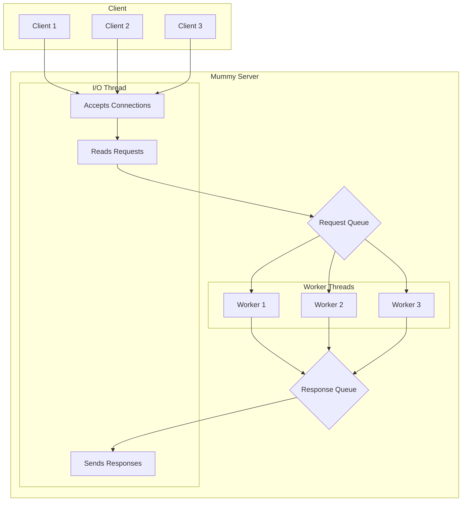
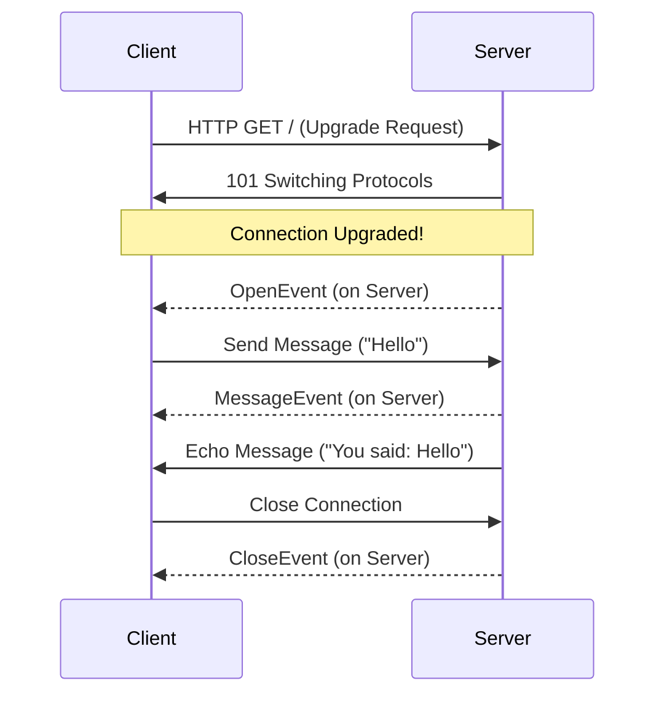
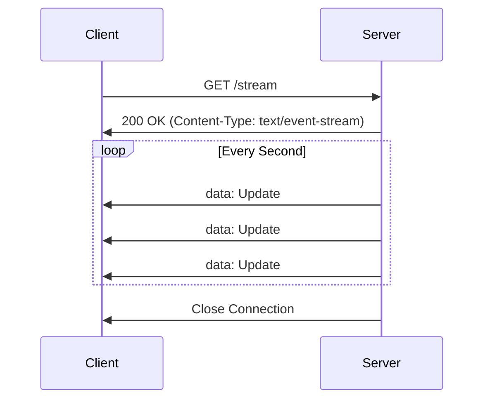

# Unwrap the Power of Mummy: A Tutorial

Welcome, brave developer, to the world of Mummy! If you're looking to build high-performance web servers in Nim without getting tangled in the wrappings of complex async/await logic, you've come to the right place. Mummy is a multithreaded HTTP and WebSocket server that's so fast, it's scary!

This tutorial will guide you through the catacombs of Mummy's features, from creating a basic server to handling real-time communication with WebSockets and Server-Sent Events (SSE).

## Getting Started: Your First Mummy Server

First things first, let's get Mummy installed. Fire up your terminal and enter the ancient command:

```bash
nimble install mummy
```

With Mummy now part of your arsenal, let's create a simple "Hello, World!" server. Create a file named `main.nim` and add the following code:

```nim
import mummy

proc handler(req: Request) =
  req.respond(200, body = "Hello from the other side!")

var server = newServer(handler)
echo "Server starting on http://localhost:8080"
server.serve(Port(8080))
```

To run your server, compile and execute the code with:

```bash
nim c -r --threads:on --mm:orc main.nim
```

> **Note:** Mummy requires the `--threads:on` and `--mm:orc` (or `--mm:arc`) flags to work its magic. Don't forget them, or the mummy might not awaken correctly!

Now, open your browser and navigate to `http://localhost:8080`. You should be greeted by a message from beyond the veil!

## Core Concepts: The I/O Thread and Worker Threads

Mummy's power comes from its multithreaded architecture. It uses a single I/O thread to handle all socket communication and a pool of worker threads to process requests. This design keeps things fast and simple.

Here's a visualization of how it works:



## Routing: Finding Your Way Through the Tomb

Mummy includes a powerful router to direct requests to the correct handlers. Let's expand our server to handle different routes:

```nim
import mummy, mummy/routers

proc handleHome(req: Request) =
  req.respond(200, body = "Welcome to the tomb!")

proc handleTreasure(req: Request) =
  let treasure = req.pathParams["treasure"]
  req.respond(200, body = "You found the " & treasure & "!")

var router: Router
router.get("/", handleHome)
router.get("/treasure/:treasure", handleTreasure)

var server = newServer(router)
echo "Server starting on http://localhost:8080"
server.serve(Port(8080))

```

Now you can visit `http://localhost:8080/treasure/golden-scarab` to see the router in action!

## WebSockets: Real-Time Communication

Mummy makes it easy to add real-time features with WebSockets. Here's how to create a simple echo server:

```nim
import mummy

proc handler(req: Request) =
  try:
    var ws = req.upgradeToWebSocket()
    ws.send("Connection upgraded!")
  except MummyError as e:
    req.respond(400, body = e.msg)

proc wsHandler(ws: WebSocket, event: WebSocketEvent, msg: Message) =
  case event:
  of OpenEvent:
    echo "WebSocket connection opened."
  of MessageEvent:
    echo "Received message: " & msg.data
    ws.send("You said: " & msg.data)
  of CloseEvent:
    echo "WebSocket connection closed."
  of ErrorEvent:
    echo "WebSocket error!"

var server = newServer(handler, wsHandler)
echo "Server starting on http://localhost:8080"
server.serve(Port(8080))
```

Here's a diagram of the WebSocket lifecycle:



## Server-Sent Events (SSE): Streaming from the Sarcophagus

For one-way communication from the server to the client, Server-Sent Events (SSE) are a fantastic choice. Here's how to stream updates from your Mummy server:

```nim
import mummy, mummy/routers, std/os

proc sseHandler(req: Request) =
  var sse = req.respondSSE()
  if not sse.active:
    return

  for i in 1..5:
    sleep(1000)
    let event = SSEEvent(data: "Update #" & $i)
    sse.send(event)
    if not sse.active:
      break

  sse.close()

var router: Router
router.get("/stream", sseHandler)

var server = newServer(router)
echo "Server starting on http://localhost:8080"
server.serve(Port(8080))
```

And a visualization of the SSE flow:



## Large File Downloads: Streaming from the Digital Pyramid

One of the most important features for modern web applications is efficient handling of large file downloads. While Mummy has excellent support for large file uploads via TUS (Tus Resumable Upload Protocol) and HTTP Range requests, efficient large file downloads require special consideration to avoid memory exhaustion and provide resumable downloads.

### The Challenge with Large Files

The standard `respond()` method in Mummy loads the entire response body into memory:

```nim
# This will consume massive memory for large files!
proc badLargeFileHandler(req: Request) =
  let fileContent = readFile("huge_movie.mp4")  # Loads entire file into RAM
  req.respond(200, body = fileContent)  # Memory exhaustion!
```

For large files (videos, datasets, software distributions), this approach:
- Exhausts server memory
- Prevents concurrent large downloads
- Doesn't support resumable downloads
- Has poor performance characteristics

### Industry Standards for Large File Downloads

The HTTP specification provides two complementary standards for efficient large file serving:

#### 1. HTTP Range Requests (RFC 7233)
Range requests allow clients to request specific byte ranges of a file, enabling:
- **Resumable Downloads**: Continue interrupted downloads
- **Partial Downloads**: Download only needed portions
- **Multi-connection Downloads**: Parallel download segments
- **Streaming Media**: Seek to specific timestamps

#### 2. Chunked Transfer Encoding (RFC 9112)
Chunked encoding allows streaming responses without knowing the total size upfront:
- **Memory Efficient**: Stream data without buffering entire response
- **Unknown Length**: Useful when content length isn't predetermined
- **Progressive Delivery**: Start sending data immediately

### Implementing Large File Downloads in Mummy

Since Mummy doesn't currently have built-in streaming file response methods, here's how to implement efficient large file downloads using the existing infrastructure:

```nim
import mummy, mummy/routers, mummy/ranges
import std/[os, strutils, mimetypes, strformat]

const CHUNK_SIZE = 64 * 1024  # 64KB chunks

proc getMimeType(filename: string): string =
  ## Simple MIME type detection based on file extension
  let ext = filename.splitFile.ext.toLowerAscii
  case ext:
  of ".mp4": "video/mp4"
  of ".pdf": "application/pdf"
  of ".zip": "application/zip"
  of ".jpg", ".jpeg": "image/jpeg"
  of ".png": "image/png"
  of ".txt": "text/plain"
  else: "application/octet-stream"

proc serveFileRange(req: Request, filepath: string, ranges: seq[ByteRange]) =
  ## Serve file with HTTP Range support
  if not fileExists(filepath):
    req.respond(404, body = "File not found")
    return
  
  let fileInfo = getFileInfo(filepath)
  let fileSize = fileInfo.size
  let mimeType = getMimeType(filepath)
  
  # Validate and normalize ranges
  var validRanges: seq[ByteRange] = @[]
  for range in ranges:
    let normalizedRange = normalizeRange(range, fileSize)
    if normalizedRange.isSome:
      validRanges.add(normalizedRange.get())
  
  if validRanges.len == 0:
    # Invalid range request
    var headers: HttpHeaders
    headers["Content-Range"] = &"bytes */{fileSize}"
    req.respond(416, headers, "Range Not Satisfiable")
    return
  
  # For simplicity, handle single range requests
  # Production code should handle multi-range requests with multipart responses
  let range = validRanges[0]
  let contentLength = range.stop - range.start + 1
  
  var headers: HttpHeaders
  headers["Content-Type"] = mimeType
  headers["Content-Length"] = $contentLength
  headers["Content-Range"] = &"bytes {range.start}-{range.stop}/{fileSize}"
  headers["Accept-Ranges"] = "bytes"
  headers["Cache-Control"] = "public, max-age=3600"
  
  # Open file and seek to start position
  let file = open(filepath, fmRead)
  defer: file.close()
  
  file.setFilePos(range.start)
  
  # For this example, we'll read the entire range into memory
  # In production, you'd want to stream this in chunks
  let rangeData = file.readStr(contentLength.int)
  
  req.respond(206, headers, rangeData)

proc serveFile(req: Request, filepath: string) =
  ## Serve complete file with optional range support
  if not fileExists(filepath):
    req.respond(404, body = "File not found")
    return
  
  # Check for Range header
  if req.headers.hasKey("Range"):
    let rangeHeader = req.headers["Range"]
    try:
      let ranges = parseRanges(rangeHeader)
      serveFileRange(req, filepath, ranges)
      return
    except:
      # Invalid range header, ignore and serve full file
      discard
  
  # Serve full file
  let fileInfo = getFileInfo(filepath)
  let fileSize = fileInfo.size
  let mimeType = getMimeType(filepath)
  
  var headers: HttpHeaders
  headers["Content-Type"] = mimeType
  headers["Content-Length"] = $fileSize
  headers["Accept-Ranges"] = "bytes"
  headers["Cache-Control"] = "public, max-age=3600"
  
  # For large files, you'd want to implement streaming here
  # This is a simplified version that loads the file into memory
  if fileSize > 10 * 1024 * 1024:  # Files larger than 10MB
    req.respond(413, body = "File too large for basic implementation")
    return
  
  let fileContent = readFile(filepath)
  req.respond(200, headers, fileContent)

proc downloadHandler(req: Request) =
  ## Handle file download requests
  let filename = req.pathParams.getOrDefault("filename", "")
  if filename.len == 0:
    req.respond(400, body = "Filename required")
    return
  
  # Security: Prevent directory traversal attacks
  if filename.contains("..") or filename.contains("/"):
    req.respond(403, body = "Invalid filename")
    return
  
  let filepath = "downloads" / filename
  serveFile(req, filepath)

# Example usage
var router: Router
router.get("/download/:filename", downloadHandler)

var server = newServer(router)
echo "File server starting on http://localhost:8080"
echo "Place files in ./downloads/ directory"
server.serve(Port(8080))
```

### Advanced Streaming Implementation

For truly large files, you need to implement streaming responses. Here's a more advanced approach that would require extending Mummy's response system:

```nim
import mummy, std/[asyncfile, asyncdispatch]

# This is a conceptual implementation - would require changes to Mummy core
proc respondFileStream*(req: Request, filepath: string, 
                       startByte: int64 = 0, endByte: int64 = -1) =
  ## Stream a file response without loading it entirely into memory
  ## This would require extending Mummy's OutgoingBuffer to support streaming
  
  if not fileExists(filepath):
    req.respond(404, body = "File not found")
    return
  
  let fileSize = getFileSize(filepath)
  let actualEndByte = if endByte == -1: fileSize - 1 else: min(endByte, fileSize - 1)
  let contentLength = actualEndByte - startByte + 1
  
  var headers: HttpHeaders
  headers["Content-Type"] = getMimeType(filepath)
  headers["Content-Length"] = $contentLength
  headers["Accept-Ranges"] = "bytes"
  
  if startByte > 0 or endByte != -1:
    headers["Content-Range"] = &"bytes {startByte}-{actualEndByte}/{fileSize}"
    # Send 206 Partial Content for range requests
    # This would require a new streaming response method in Mummy
    req.respondStreamingFile(206, headers, filepath, startByte, actualEndByte)
  else:
    # Send 200 OK for full file
    req.respondStreamingFile(200, headers, filepath, 0, fileSize - 1)
```

### Current Limitations and Future Enhancements

**Current Limitations:**
1. **Memory-Bound Responses**: Current `respond()` method requires entire response in memory
2. **No Built-in Range Support**: No automatic range request handling for downloads
3. **No Streaming API**: No way to stream large responses efficiently
4. **No Multi-Range Support**: Cannot handle multiple range specifications in one request

**Recommended Enhancements:**
1. **New Response Methods**:
   ```nim
   proc respondFile*(req: Request, filepath: string, 
                    contentType: string = "", 
                    attachment: bool = false)
   proc respondRange*(req: Request, filepath: string, 
                     ranges: seq[ByteRange])
   proc respondStream*(req: Request, stream: Stream, 
                      contentLength: int64, contentType: string)
   ```

2. **Enhanced OutgoingBuffer**:
   - Support for file handles instead of string buffers
   - Streaming capability with chunked transfer encoding
   - Multi-range response support with multipart boundaries

3. **Built-in MIME Detection**:
   ```nim
   proc detectMimeType*(filename: string): string
   proc setContentDisposition*(headers: var HttpHeaders, 
                              filename: string, attachment: bool = false)
   ```

### Real-World Example: Video Streaming Server

Here's a practical example of serving video files with range support:

```nim
import mummy, mummy/routers
import std/[os, strformat]

proc serveVideo(req: Request) =
  let videoFile = req.pathParams["video"]
  let videoPath = "videos" / videoFile & ".mp4"
  
  if not fileExists(videoPath):
    req.respond(404, body = "Video not found")
    return
  
  let fileSize = getFileSize(videoPath)
  
  # Check for range requests (essential for video streaming)
  if req.headers.hasKey("Range"):
    let rangeHeader = req.headers["Range"]
    # Parse range header: "bytes=200-1023" or "bytes=200-"
    if rangeHeader.startsWith("bytes="):
      let rangeSpec = rangeHeader[6..^1]
      let parts = rangeSpec.split("-")
      
      if parts.len == 2:
        let startByte = if parts[0].len > 0: parseInt(parts[0]) else: 0
        let endByte = if parts[1].len > 0: parseInt(parts[1]) else: fileSize - 1
        
        let contentLength = endByte - startByte + 1
        
        var headers: HttpHeaders
        headers["Content-Type"] = "video/mp4"
        headers["Content-Length"] = $contentLength
        headers["Content-Range"] = &"bytes {startByte}-{endByte}/{fileSize}"
        headers["Accept-Ranges"] = "bytes"
        
        # Read specific range (in production, stream this)
        let file = open(videoPath, fmRead)
        file.setFilePos(startByte)
        let videoData = file.readStr(contentLength)
        file.close()
        
        req.respond(206, headers, videoData)  # 206 Partial Content
        return
  
  # Serve full file if no range specified
  var headers: HttpHeaders
  headers["Content-Type"] = "video/mp4"
  headers["Content-Length"] = $fileSize
  headers["Accept-Ranges"] = "bytes"
  
  let videoData = readFile(videoPath)
  req.respond(200, headers, videoData)

# HTML5 video player page
proc videoPlayer(req: Request) =
  let html = """
<!DOCTYPE html>
<html>
<head>
    <title>Video Streaming with Mummy</title>
</head>
<body>
    <h1>Video Streaming Test</h1>
    <video width="800" height="600" controls>
        <source src="/video/sample" type="video/mp4">
        Your browser does not support the video tag.
    </video>
</body>
</html>
"""
  var headers: HttpHeaders
  headers["Content-Type"] = "text/html"
  req.respond(200, headers, html)

var router: Router
router.get("/", videoPlayer)
router.get("/video/:video", serveVideo)

var server = newServer(router)
echo "Video streaming server starting on http://localhost:8080"
echo "Place MP4 files in ./videos/ directory"
server.serve(Port(8080))
```

### Best Practices for Large File Downloads

1. **Always Support Range Requests**: Essential for media files and resumable downloads
2. **Set Appropriate Cache Headers**: Reduce server load for static content
3. **Use Streaming**: Avoid loading entire files into memory
4. **Implement Security**: Prevent directory traversal and unauthorized access
5. **Add Compression**: Use gzip for compressible content (not already compressed files)
6. **Monitor Performance**: Track download metrics and server resources
7. **Handle Errors Gracefully**: Provide meaningful error messages for failed downloads

### Conclusion

While Mummy currently lacks built-in streaming file response capabilities, the existing HTTP Range parsing infrastructure provides a foundation for implementing efficient large file downloads. The examples above demonstrate practical approaches to serving large files, with the understanding that production implementations would benefit from streaming response methods built into Mummy's core response system.

For immediate needs, the memory-conscious approaches shown here can handle moderately large files efficiently, while the conceptual streaming implementations point toward future enhancements that would make Mummy ideal for high-volume file serving applications.

## Summary

You've now unearthed the main features of Mummy! You've learned how to create a server, handle routes, implement real-time communication with WebSockets and SSE, and serve large files efficiently. Now go forth and build amazing things with the power of Mummy!

For more examples, be sure to check out the `examples` directory in the Mummy repository.