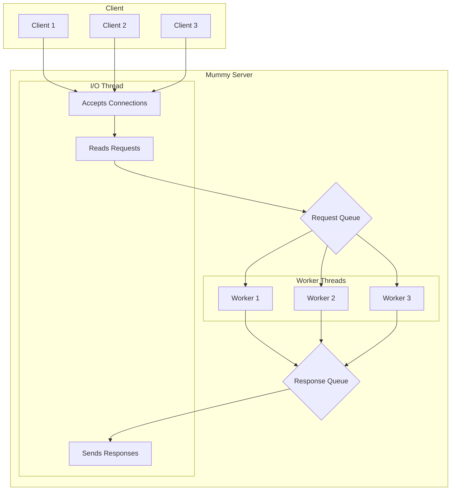
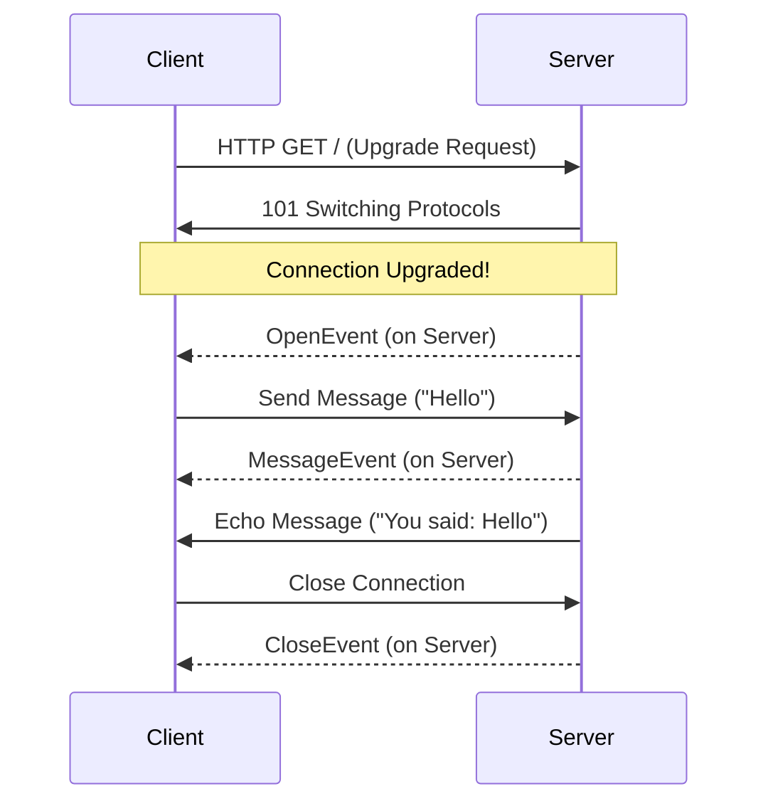

# Unwrap the Power of Mummy: A Tutorial

Welcome, brave developer, to the world of Mummy! If you're looking to build high-performance web servers in Nim without getting tangled in the wrappings of complex async/await logic, you've come to the right place. Mummy is a multithreaded HTTP and WebSocket server that's so fast, it's scary!

This tutorial will guide you through the catacombs of Mummy's features, from creating a basic server to handling real-time communication with WebSockets and Server-Sent Events (SSE).

## Getting Started: Your First Mummy Server

First things first, let's get Mummy installed. Fire up your terminal and enter the ancient command:

```bash
nimble install mummy
```

With Mummy now part of your arsenal, let's create a simple "Hello, World!" server. Create a file named `main.nim` and add the following code:

```nim
import mummy

proc handler(req: Request) =
  req.respond(200, body = "Hello from the other side!")

var server = newServer(handler)
echo "Server starting on http://localhost:8080"
server.serve(Port(8080))
```

To run your server, compile and execute the code with:

```bash
nim c -r --threads:on --mm:orc main.nim
```

> **Note:** Mummy requires the `--threads:on` and `--mm:orc` (or `--mm:arc`) flags to work its magic. Don't forget them, or the mummy might not awaken correctly!

Now, open your browser and navigate to `http://localhost:8080`. You should be greeted by a message from beyond the veil!

## Core Concepts: The I/O Thread and Worker Threads

Mummy's power comes from its multithreaded architecture. It uses a single I/O thread to handle all socket communication and a pool of worker threads to process requests. This design keeps things fast and simple.

Here's a visualization of how it works:



## Routing: Finding Your Way Through the Tomb

Mummy includes a powerful router to direct requests to the correct handlers. Let's expand our server to handle different routes:

```nim
import mummy, mummy/routers

proc handleHome(req: Request) =
  req.respond(200, body = "Welcome to the tomb!")

proc handleTreasure(req: Request) =
  let treasure = req.pathParams["treasure"]
  req.respond(200, body = "You found the " & treasure & "!")

var router = newRouter()
router.add(HttpGET, "/", handleHome)
router.add(HttpGET, "/treasure/:treasure", handleTreasure)

var server = newServer(router.handler)
echo "Server starting on http://localhost:8080"
server.serve(Port(8080))

```

Now you can visit `http://localhost:8080/treasure/golden-scarab` to see the router in action!

## WebSockets: Real-Time Communication

Mummy makes it easy to add real-time features with WebSockets. Here's how to create a simple echo server:

```nim
import mummy

proc handler(req: Request) =
  try:
    var ws = req.upgradeToWebSocket()
    ws.send("Connection upgraded!")
  except MummyError as e:
    req.respond(400, body = e.msg)

proc wsHandler(ws: WebSocket, event: WebSocketEvent, msg: Message) =
  case event:
  of OpenEvent:
    echo "WebSocket connection opened."
  of MessageEvent:
    echo "Received message: " & msg.data
    ws.send("You said: " & msg.data)
  of CloseEvent:
    echo "WebSocket connection closed."
  of ErrorEvent:
    echo "WebSocket error!"

var server = newServer(handler, wsHandler)
echo "Server starting on http://localhost:8080"
server.serve(Port(8080))
```

Here's a diagram of the WebSocket lifecycle:



## Server-Sent Events (SSE): Streaming from the Sarcophagus

For one-way communication from the server to the client, Server-Sent Events (SSE) are a fantastic choice. Here's how to stream updates from your Mummy server:

```nim
import mummy, mummy/routers, std/times

proc sseHandler(req: Request) =
  var sse = req.respondSSE()
  if not sse.active:
    return

  for i in 1..5:
    sleep(1000)
    let event = SSEEvent(data: "Update #" & $i)
    sse.send(event)
    if not sse.active:
      break

  sse.close()

var router = newRouter()
router.add(HttpGET, "/stream", sseHandler)

var server = newServer(router.handler)
echo "Server starting on http://localhost:8080"
server.serve(Port(8080))
```

And a visualization of the SSE flow:

```mermaid
sequenceDiagram
    participant Client
    participant Server

    Client->>Server: GET /stream
    Server->>Client: 200 OK (Content-Type: text/event-stream)

    loop Every Second
        Server->>Client: data: Update #1
        Server->>Client: data: Update #2
        ...
    end

    Server->>Client: Close Connection
```

## Conclusion

You've now unearthed the main features of Mummy! You've learned how to create a server, handle routes, and implement real-time communication with WebSockets and SSE. Now go forth and build amazing things with the power of Mummy!

For more examples, be sure to check out the `examples` directory in the Mummy repository.
